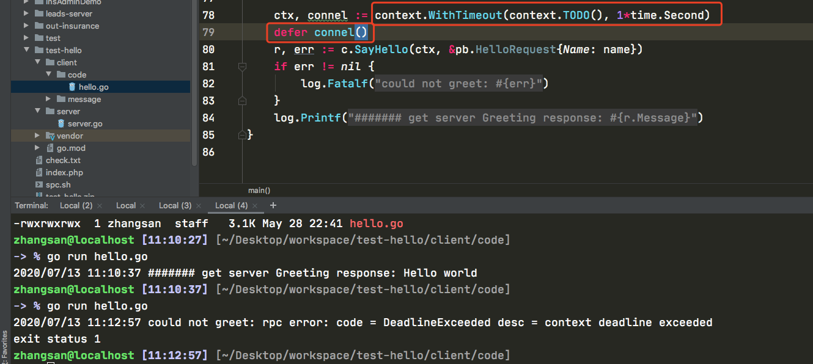
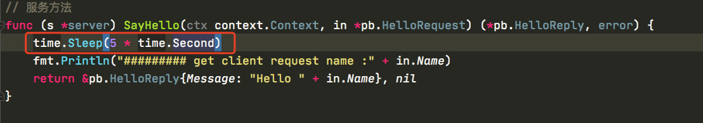
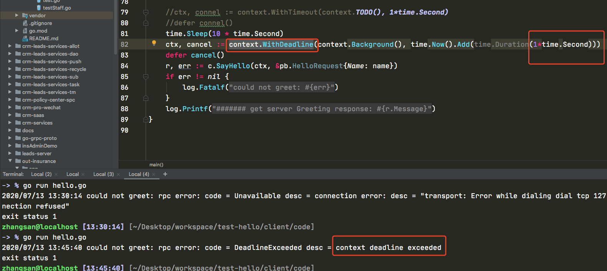
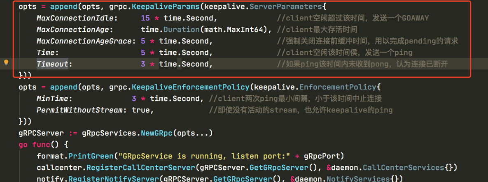

# context deadline exceeded

## 第一种 context.WithTimeout

客户端

服务端

问题总结

- 客户端用的上下文是context.WithTimeout 超时时间小于服务端的返回时间，造成 ==context deadline exceeded==

## 第二种 context.WithDeadline

客服端

服务端

响应时间超过1秒

结论

- 服务端响应时间超过客户端的等待时间

# Grpc的链接选项配置

